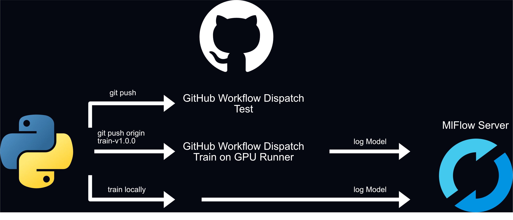

# MLOps CI/CD Pipeline  
[]()  

This repository implements an end-to-end MLOps pipeline for training, evaluating, auto-promoting, and deploying a PyTorch image-classification model (AlexNet on CIFAR-10). 
It uses MLflow for experiment tracking and model management, and Hugging Face for deployment.

Here are the links to the demo. 
The MLflow server credentials can be found on our presentation slides.

- [MLflow Server](https://mlflow.berinet.ch)
- [Hugging Face Space](https://huggingface.co/spaces/Maxinio-Berincini/HSG-FS25-MLOps-CI_CD_Pipeline)

---

## Table of Contents
- [Getting Started](#getting-started)  
  - [Prerequisites](#prerequisites)  
  - [Installation](#installation)  
  - [Configuration (`.env`)](#configuration-env)  
- [Workflow Overview](#workflow-overview)  
- [Usage](#usage)  
  - [1. Configure Run](#1-configure-run)  
  - [2. Train](#2-train)  
  - [3. Evaluate & Promote](#3-evaluate--promote)  
  - [4. Deploy to Hugging Face](#4-deploy-to-hugging-face)  
  - [5. Launch Gradio App](#5-launch-gradio-app)
- [Webhook Workaround with n8n](#webhook-workaround-with-n8n)  
- [MLflow Webhook PR](#mlflow-webhook-pr) 

---

## Getting Started

### Prerequisites

- **MLflow tracking server** (local or remote)  
- **Hugging Face Repository**

### Installation

1. **Clone**  
   ```bash
   git clone https://github.com/Maxinio-berincini/HSG-FS25-MLOps-CI_CD_Pipeline.git
   cd HSG-FS25-MLOps-CI_CD_Pipeline

2. **Create a virtual environment**

   ```bash
   python -m venv venv
   source venv/bin/activate   # macOS/Linux
   venv\Scripts\activate      # Windows
   ```

3. **Install dependencies**

   ```bash
   pip install -r requirements.txt
   ```

### Configuration (`.env`)

Add the MLflow tracking server and Hugging Face credentials to the `.env` file in the `configs/` directory.

```env
MLFLOW_TRACKING_URI= <https://your MLFlow Server.com>
MLFLOW_TRACKING_USERNAME= <your Username>
MLFLOW_TRACKING_PASSWORD= <your Password>
HF_TOKEN= <your HuggingFace Token>
```

---

## Workflow Overview

Below is the high-level overview of our pipeline.




---


1. **Local Train**

   * `python scripts/train.py` trains a new model and logs everything to the MLflow server.

2. **Remote Train via Git Tag**

   * Tag your commit: `git tag train-vX.Y.Z`
   * GitHub Actions picks it up on a GPU runner, trains, and logs to MLflow.

3. **Model Registration**

   * Once training finishes, the new model is registered in the MLflow Model Registry.

4. **n8n Listener**

   * n8n polls the MLflow Postgres backend, detects new models and triggers **Evaluate** workflow.

5. **Evaluate & Promote**

   * GitHub Action runs `scripts/evaluate_and_promote.py`. On success, challenger is aliased to `production` and the **Deploy** workflow is triggered.

6. **Deploy**

   * GitHub Action runs `scripts/deploy_to_hf.py` and updates the Hugging Face Space.

7. **Tests on Production Branch**

   * Any push or PR to the `production` branch automatically runs `pytest` tests.

---

## Usage

### 1. Configure Run
* configure your MLflow run in the `scripts/utils/config.py` file.

### 2. Train

```bash
python scripts/train.py
```

* Logs metrics/params to MLflow
* Trains a PyTorch model on CIFAR-10
* Saves the best checkpoint under `model_artifacts/`

### 3. Evaluate & Promote

```bash
python scripts/evaluate_and_promote.py
```

* Computes bootstrap CIs on test set
* Checks DSL test condition (`configs/test_condition.txt`)
* Test condition is specified in the following format:  
  - `'n - o > d +/- epsilon'` where:  
    - `n`: accuracy of the new (challenger) model  
    - `o`: accuracy of the old (production) model  
    - `d`: minimum accuracy improvement  
    - `epsilon`: the half-width of the confidence interval
* If passed, aliases the challenger as `production` in MLflow

### 4. Deploy to Hugging Face

```bash
python scripts/deploy_to_hf.py
```

* Downloads the production model artifacts
* Injects version & description into `app/app.py`
* Pushes model files to your HF Space repo

### 5. Launch Gradio App

```bash
python app/app.py
```

* Starts a web UI for image classification
* Shows top-10 CIFAR-10 class probabilities

---

## Webhook Workaround with n8n

MLflow does not natively support webhooks yet. 
We use n8n as an external “listener”:

1. n8n connects directly to the MLflow Postgres database.
2. A polling trigger watches the `model_versions` table for inserts.
3. On new model registration, n8n calls the GitHub API to dispatch the **Evaluate** workflow.

---

## MLflow Webhook PR

The Community and the MLflow team are currently working on a webhook feature.
Once merged, we can replace the n8n workaround with a direct subscription to MLflow webhooks.

Here are the issue and the PR:
- [Issue](https://github.com/mlflow/mlflow/issues/14677)
- [PR](https://github.com/mlflow/mlflow/pull/15202)


---
